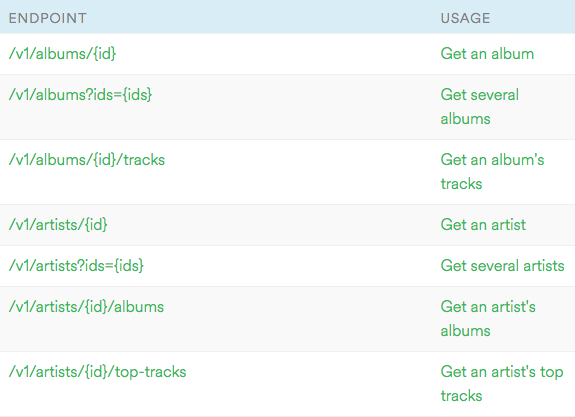

An API allows two computer programs to communicate over the internet.

Fed up of copy and pasting between different systems? APIs can help.

Want to pull out the data from one website and do some cool stuff with it? APIs are the bomb.

READMORE

## What are APIs used for?

1. Login a user via Twitter, Facebook or Google
2. Share data between two websites

### 1. Login a user via Twitter, Facebook or Google 

You want to sign up for a Spotify account but don't want to remember another stupid password.

Spotify allows sign in using your Facebook account.

When you press that "Sign in using Facebook" button:

* Spotify calls the Facebook API - "Hey! Is John Gallagher signed into Facebook at the moment?"
* Facebook returns with "Yeah dude, totally! Let him through!"
* Spotify asks the Facebook API again - "So what are his details?"
* Facebook returns with "He's 39, single, lives in Glasgow."

Spotify creates an account for you with those details and you're done.

### 2. Share data between two websites

You want to see what playlists your Facebook friend George Clooney has.

You click on the "Playlists of my friends" in Spotify:

* Spotify calls the Facebook API - "Hey! What friends does John Gallagher have?"
* Facebook replies - "He's friends with Neve Campbell, George Clooney and Patricia Arquette."
* Spotify shows you all your friends in a list
* You click on George Clooney. Spotify shows you his playlists.

## How does an API work?

It's a conversation between two computers. One computer makes a request to the API, the other responds.

### Human example - asking for lunch

* Request: "Hey, can you get me a chicken salad sandwich please?"
* Response: "Sure, here you go. It was £3.21."
* Request: "Oh man - you got me the cheapo own brand sandwich? Rubbish! Can you take it back and get me another?"
* Response: "No. Get lost. Honestly. You're so demanding."

### Computer example - getting all the track from David Bowie's Blackstar album

* Request: "Hey, Spotify API, can you get me all the tracks for the Blackstar album please?"
* Response: "Sure, here you go. They are: Blackstar, Lazarus etc"
* Request: "Cool. Can I see more details for that third track please?"
* Response: "Certainly. Here you go. It's written by David Bowie and it's got album art."

**Aside** Want a practical? Try my tutorial to [get the tracks of an album using the Spotify API!](/using-the-spotify-api-to-get-an-albums-tracks)

## How does an API send it's data?

Three different kinds of API:

1. REST formatted with JSON
2. REST formatted with XML
2. SOAP formatted with XML

Of these, REST using the JSON format is the most popular.

**Question** Why does SOAP not have a JSON format?

Because JSON wasn't around when SOAP was invented.

## What is REST?

## What is SOAP?

## What is XML?

## What is JSON?

## What are requests and responses?

Like browsers, APIs use **requests and responses**.

They're packets of information flying around. 

You can imagine them as letters between friends.

Making a request to an API is a bit like writing a letter to your pen pal.

Getting the response back is a bit like getting a reply letter back through your letterbox. Aw!

* One app makes a request 
* Another app replies with a response 

**Aside** They're sometimes called HTTP requests or responses. HTTP is the base layer that everything else works on top of. [Read more about HTTP](/what-is-http)

## Anatomy of a request

Three different bits of a request:

1. URL
2. Method
3. Body
4. Headers

### 1. URL 

The request needs to know where it's going. 

The URL is like the address on the outside of a letter. That's why it's sometimes called a web address.

*Example* `https://api.spotify.com/v1/artists/abcde`

### 2. HTTP method

This is a bit like the tone of your letter. You could write a sad, angry or happy letter.

The method let's you know what the side effect of your request will be.

**Side effect? Huh?**

An API request could be just getting some data from another web site.

But there are also requests that create new data, change existing data and, most scary of all, delete data.

If you made a request to get a list of films Al Pacino has been in, I'm sure he'd be cool with that.

If you made a request which deleted his whole filmography... that's a very different story. I imagine you'd get SHOUTY AL PACINO.

**What methods are there?**

We use 4 methods. And for some reason they're all in capitals. Maybe that's AL PACINO'S SHOUTY INFLUENCE. Dunno.

|Method|Meaning|
|:-----|:------|
|GET|Get some data. Don't change nothing!|
|POST|Create data. New things! Fun!|
|PUT|Change data. Maybe you need to update something?|
|DELETE|Delete data. Nope, it's gone for good. Soz!|
{: class="pure-table"}

### 3. Body

The content of your letter. 

For a GET request this is blank. A GET request is like sending your friend an empty postage paid envelope to send you a letter back.

A POST request needs to create an object. If we wanted to create a new contact, we'd use the body to send the name, address age etc.

The body has the same format as the rest of the API - usually JSON or XML.

### 4. Headers

Headers are for extra stuff. Like fancy stamps on your letter.

APIs have access to some pretty sensitive stuff. So they often need you to do a kind of ultra secure Fort Knox style sign in.

If you need to give your username and password to an API, you use the headers to pass this in.

## What's in a response?

Three bits:

1. Status
2. Body
3. Headers

## 1. Status

Was this request successful? 

Did your letter make your friend angry, happy, sad? Did your letter even reach your friend?

There are loads of status codes. Here are a few common ones:

|Code|Meaning|
|:---|:------:
|200|Success!|
|301|Redirect - sorry, this has moved.|
|404|Not found - this doesn't exist any more. Whoops!|
|500|The app crashed. Oh dear. A geek is about to get fired.|
{: class="pure-table"}

## 2. Body

The juicy bit - what's in the letter your friend wrote back to you?

For successful GET requests, this is the data from the API. Again, it'll be in JSON or XML format.

For successful POST requests that create stuff, it might be empty. For failing create requests, it'll contain an error message.

## 3. Headers

The extra bits again. All sorts of crap like when the page was modified, what software's on the server and what your granny had for dinner tonight.

Usually you can ignore this.

### What's an endpoint?

URLs for a feature that an API offers.

For example, [here are the endpoints](https://developer.spotify.com/web-api/endpoint-reference/) of the Spotify API:

**Question** Where's the start of the URL?

At the [top of the page]() it says "Web API Base URL: https://api.spotify.com"

In API documentation, we exclude the start bit so we don't have to keep repeating it.

If the endpoint is `/v1/albums` the full endpoint URL will be `https://api.spotify.com/v1/albums`

**Question** What do the things in curly braces mean?

It means "put a unique identifier here".

The first endpoint is `/v1/albums/{id}` so we should replace the `{id}` for the album ID we want.

## Putting it all together - an example

## Why are APIs so groovy?

APIs allow us to make apps that munge, merge and combine loads of different data together.

Most apps you use every day have an API. Here are just a few:

* Wikipedia API
* Trello API
* Spotify API
* Google Maps API
* Google Adwords API
* Google Analytics API
* Google News API
* Facebook API
* Twitter API
* Soundcloud API

This is a tiny selection - there are *thousands* of APIs out there.

### API Munging Ideas

Let's say you manage an Adwords account for a music retailer.

How about:

* Finding the most popular artists on Spotify
* Getting their birthdays from Wikipedia
* Creating automated AdWords campaigns that will go live on their birthdays every year
* The adverts could sell their highest rating album according to AllMusic.com

Or maybe:

* Find any trending music artists in the news via Google News
* For each artist, create 5 adwords campaigns for their biggest selling albums
* The campaigns would be geographically targeted to the countries where they have the biggest followings

Mindblowing huh?

Bottom line - if you learn how to write code that uses APIs, you can do magic.

