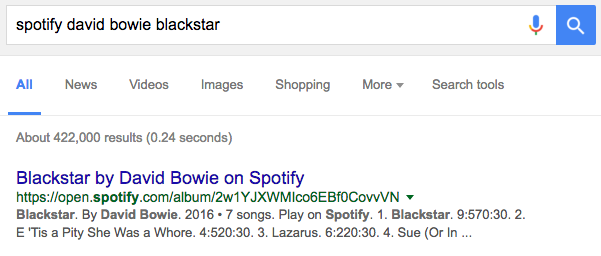
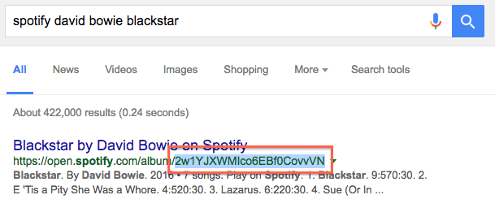
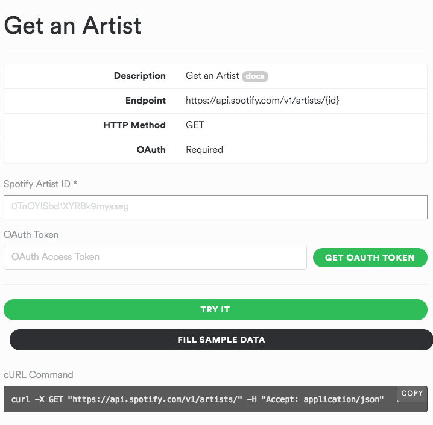
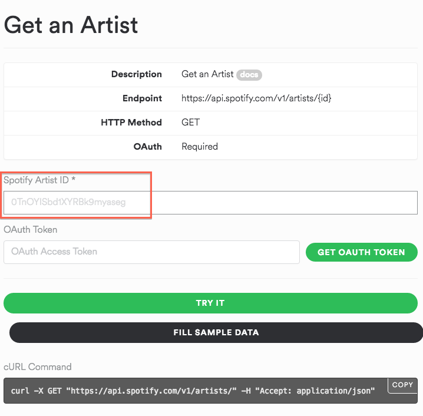
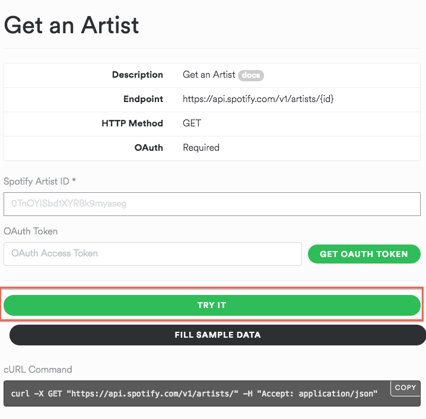
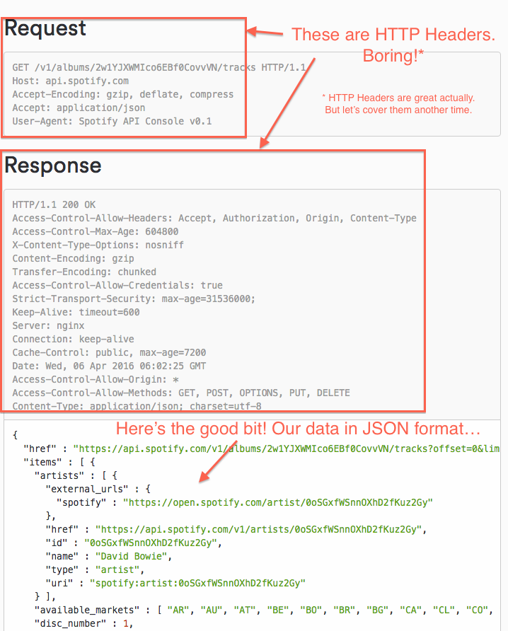
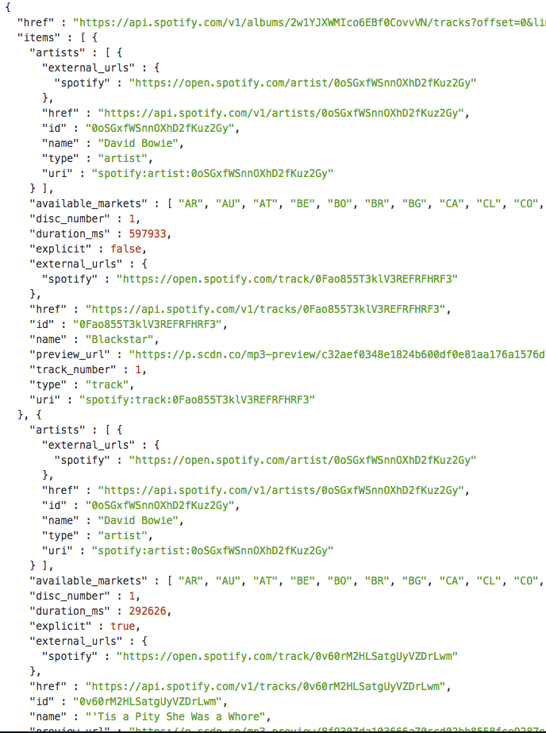
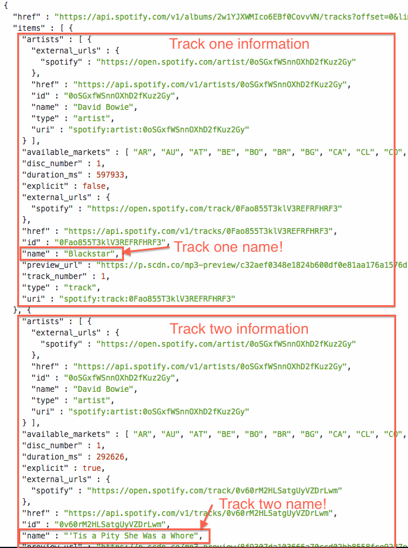
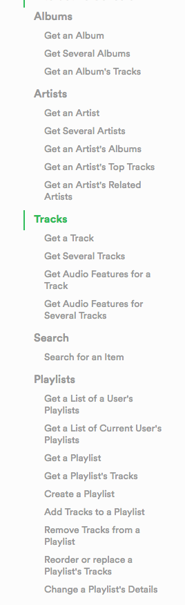

[What is an API?](/what-is-an-api) gave the theory of an API.

Now it's time to get your hands dirty.

We'll get all the track names David Bowie's Blackstar album using the Spotify API.

READMORE

### 1. Find the Blackstar Album

* The Spotify API has a unique ID for every album. 
* We need to get the unique ID for Blackstar. Google for "David Bowie Blackstar Spotify"

### 2. Get the Album ID

* Select the long nonsense number at the end.
* Go `Edit > Copy` to copy to the clipboard

### 3. Launch the Spotify API Explorer

* [Go to the Spotify API explorer](https://developer.spotify.com/web-api/console/get-album-tracks/)

### 4. Enter the Album ID

* `Edit > Paste` in the Album ID text box

### 5. Make the request

* Click `Try it!`

### 6. Check it out!

> What the...?

Yeah, I know. It's a lot to take in.

* All the crap in grey are the HTTP Headers. That's the boring bit. Skip it.
* The data at the bottom is the juicy bit. Let's have a look at that.

### 7. Scroll down

> Hurgh. I'm getting a headache. This is *really* hard to read.

Agreed. Why? Because an API is designed so that one website can talk to another. It's two computers chatting to another.

For us humans an API response can be pretty overwhelming to understand. But a computer just loves this nested intense splurge of pure data.

Without pretty styles and fonts, the computer can grab all this data and do a million interesting things with it.

This is a JSON API, so this is the data formatted as JSON.

### 8. Read the track names in the response

* See that little "items" near the top? That's where the list of tracks begin.
* And in amongst the crap in "items", you can see the names of the tracks.

### 9. All done!

The Spotify API is incredibly powerful. Check out all the things you can do with it:

And it's all free!

### 10. Have a play yourself

[Visit the Spotify Explorer](https://developer.spotify.com/web-api/console) and play around.

And [tweet at me](http://twitter.com/synapticmishap) if you've got any questions or comments on this tutorial.

Thanks!
